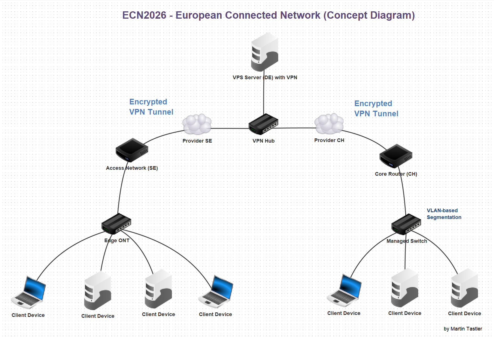

🌍 Language: [English](README.md) | [Svenska](README.sv.md)

# ECN2026 – European Connected Network

## Översikt
ECN2026 är ett personligt nätverkstekniskt projekt som simulerar ett
multi-site-nätverk i Europa med platser i Sverige, Schweiz och Tyskland.

Målet är att designa, implementera och dokumentera en realistisk campus-
och backbone-arkitektur med begränsad hårdvara, baserad på
enterprise-liknande koncept.

## Platser
- Sverige (Access-site)
- Schweiz (Core / Campus-site)
- Tyskland (Cloud / VPS-backbone)

## Centrala områden
- Routing och subnetting
- VLAN-baserad segmentering
- Site-to-site VPN (WireGuard)
- Brandväggar och grundläggande hardening
- Övervaknings- och loggningskoncept

## Repositoriets struktur
ECN2026/
├── docs/        # Arkitektur, koncept och förklaringar
├── sites/       # Plats-specifik dokumentation
├── configs/     # Sanerade konfigurationsexempel
├── diagrams/    # Nätverksdiagram (PNG / SVG)
└── notes/       # Läranteckningar och observationer

## Status
🚧 Pågående arbete (2026)

## Projekt-roadmap

**Fas 1 – Grundläggande konnektivitet**
- Basanslutning
- Routing-grunder
- Grundläggande brandväggsregler

**Fas 2 – Segmentering & multi-site**
- VLAN-baserad segmentering
- Site-to-site VPN (WireGuard)
- Nätverksisolering och zonindelning

**Fas 3 – Säkerhet & drift**
- Förstärkt brandväggskonfiguration
- Övervaknings- och loggningskoncept
- Test av failover och resiliens

## Nätverksöversiktsdiagram

*Detta diagram är en förenklad och abstrakt representation som skapats
för utbildnings- och dokumentationssyften. Det avslöjar inga verkliga
infrastrukturd detaljer.*

*Diagrammet är skapat med nätverkssimulatorn Filius.*

## Ansvarsfriskrivning
Detta repository innehåller inga verkliga autentiseringsuppgifter,
IP-adresser eller leverantörsspecifik information.
Alla diagram är förenklade representationer skapade med simuleringsverktyg
och avspeglar inte en produktionsmiljö.
