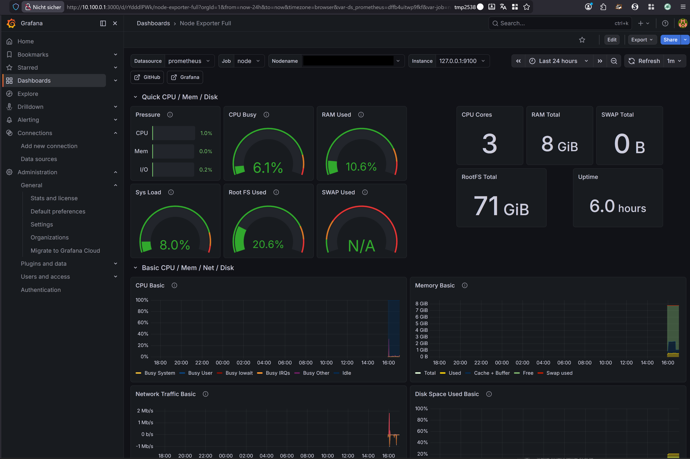

# Grafana Monitoring

Grafana is used in the ECN2026 infrastructure to visualize system metrics collected by Prometheus.

The monitoring stack consists of:

Node Exporter → Prometheus → Grafana

Node Exporter collects system metrics, Prometheus stores them as time-series data, and Grafana provides dashboards for visualization.

---

# Deployment

Grafana runs as a Docker container on the VPS.

Default port:

3000

Access to the Grafana interface is restricted to the WireGuard VPN network.


Internet
│
└── blocked
│
▼
WireGuard VPN
│
└── Grafana

---

# Data Source

Grafana uses Prometheus as its primary data source.

Configuration:
```
URL: http://127.0.0.1:9090
Access: Server
```

The connection allows Grafana to query metrics stored in Prometheus.

---

# Dashboards

The following dashboard is used for system monitoring:

Node Exporter Full  
Grafana Dashboard ID: 1860

The dashboard provides insights into:

- CPU utilization
- memory usage
- disk usage
- filesystem activity
- network traffic
- system load

---

# Purpose within ECN2026

Grafana enables visualization of infrastructure metrics and helps to:

- monitor server performance

- detect resource bottlenecks

- verify system stability

- gain hands-on experience with observability tools used in modern infrastructure environments


