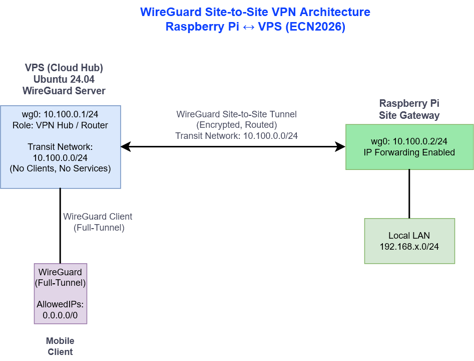

# WireGuard Site-to-Site VPN  
**Raspberry Pi ↔ VPS**  
*ECN2026 – Network Architecture*

> **Architecture Diagram:**  
> 
> *Source: `wireguard-site-to-site.drawio.png`*
> The diagram illustrates the routed Site-to-Site VPN topology and transit network separation.
---

## TL;DR

- WireGuard is used to establish a **Site-to-Site VPN** between an on-premise network and a cloud-based VPS  
- A **dedicated transit network (10.100.0.0/24)** is used exclusively for VPN routing  
- The Raspberry Pi acts as a **site gateway**, not as an end client  
- The setup enables routed, persistent connectivity without NAT or port forwarding

---

## Objective

The objective of this setup is to implement a **persistent, routed Site-to-Site VPN** that:

- connects a local on-premise network behind a Raspberry Pi  
- with a cloud-based VPS  
- using **Layer-3 routing** instead of application-level tunnels or NAT-based solutions  

The design prioritizes **clarity, scalability, and operational stability**.

---

## Architecture Overview

The VPN follows a **hub-and-site model**:

- The **VPS** acts as a central hub  
- The **Raspberry Pi** represents a remote site gateway  
- End clients may connect either locally or via full-tunnel WireGuard clients  

### Simplified Topology
[ Client / Smartphone ]
|
(WireGuard Client)
|
VPS
10.100.0.1
|
── Site-to-Site VPN ──
|
Raspberry Pi
10.100.0.2
|
Local LAN (e.g. 192.168.x.0/24)

---

## Addressing & Network Design

### Transit Network

- **Network:** `10.100.0.0/24`  
- **Purpose:** VPN transport and routing only  
- **Scope:** WireGuard interfaces and peer endpoints  

**Design Rationale:**

- Clear separation between **transport** and **service/client** networks  
- Simplified troubleshooting and routing logic  
- Improved scalability for additional sites or gateways  

The transit network does **not** host services or end clients.

---

### Local & Client Networks

- Local LAN networks remain **unchanged**  
- Networks are advertised via `AllowedIPs`  
- No NAT is required between sites  

Routing decisions are fully controlled by WireGuard’s peer configuration.

---

## Implementation Details

### WireGuard Installation (Raspberry Pi)

- Installed via distribution package manager  
- Interface managed using `wg-quick`  
- Cryptographic keys generated locally on each system  

---

### Site-to-Site Peer Configuration

#### Raspberry Pi → VPS

- **Endpoint:** VPS public IP address  
- **AllowedIPs:**  
  - Transit network  
  - Remote LAN networks  
- Acts as the **default gateway** for its local LAN into the VPN

#### VPS → Raspberry Pi

- Peer configured with:
  - Static VPN address of the Raspberry Pi (`/32`)  
  - Remote LAN subnet behind the Raspberry Pi  

This establishes **bidirectional routing** between both sites.

---

## Routing & Forwarding

- **IP forwarding** is enabled on the Raspberry Pi  
- The VPS operates as a **central routing hub**  
- No port forwarding is required on either side  

Routing behavior is deterministic and based solely on IP prefixes.

---

## Autostart & Reliability

- WireGuard interface (`wg0`) is managed via **systemd**  
- Service depends on `network-online.target`  
- VPN connectivity persists across:
  - system reboots  
  - network interruptions  
  - power outages  

---

## Testing & Validation

### Functional Validation

- Successful ICMP connectivity between VPS and Raspberry Pi  
- SSH access established exclusively via VPN  
- Mobile clients verified using full-tunnel configuration  
- Remote LAN access confirmed through routed subnets  

---

### Observations

- The dedicated transit network significantly simplifies diagnostics  
- Site-to-Site mode is more stable than client-only tunnels  
- `AllowedIPs` provide precise and transparent routing control  

---

## Site-to-Site vs Full-Tunnel VPN

| Aspect | Site-to-Site | Full-Tunnel |
|------|-------------|------------|
| Primary purpose | Network interconnection | Client traffic tunneling |
| Routing model | Selective | `0.0.0.0/0` |
| Gateway role | Required | Not applicable |
| Scalability | High | Limited |

---

## Conclusion

This setup results in a **clean, scalable, and production-oriented VPN architecture** that:

- follows established networking best practices  
- supports multi-site expansion  
- provides a solid foundation for future modules such as:
  - firewall segmentation  
  - monitoring and logging  
  - security hardening  

---

## Future Improvements

- Site-specific firewall policies  
- Monitoring of WireGuard handshakes and tunnel state  
- Integration of additional sites or gateways  
- Extended security documentation

> Reference diagram: `docs/diagrams/vpn/wireguard-site-to-site.drawio`
