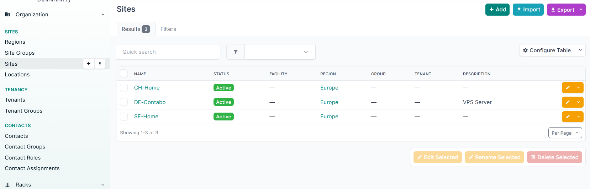
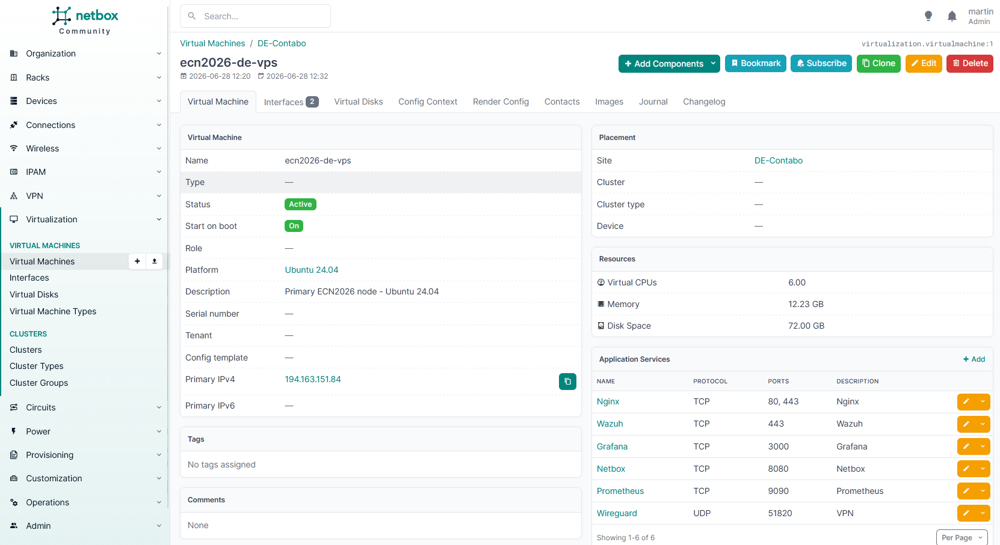
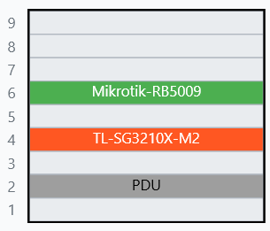
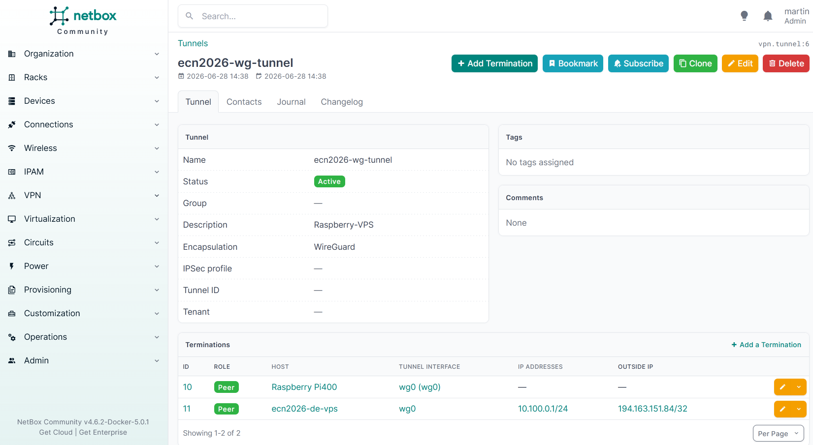

# NetBox — Infrastructure Documentation & Source of Truth

## Purpose within ECN2026

NetBox serves as the **Source of Truth** for the ECN2026 lab infrastructure. It provides structured documentation of all physical devices, virtual machines, network interfaces, IP address management (IPAM), and VPN tunnels across three European sites.

In professional network environments, NetBox is widely used to maintain an authoritative inventory of infrastructure — replacing scattered spreadsheets and informal documentation. This deployment demonstrates the ability to inventory and document a multi-site network in a tool used by real-world network and infrastructure teams.

---

## Architecture

```
Region: Europe
├── Site: DE-Contabo (Germany)
│   └── VM: ecn2026-de-vps (Ubuntu 24.04)
│       ├── Interface: eth0 — 194.163.151.84/32 (Public)
│       ├── Interface: wg0  — 10.100.0.1/24 (WireGuard)
│       └── Services: Nginx, WireGuard, Grafana, Wazuh, NetBox, Prometheus
│
├── Site: CH-Home (Switzerland)
│   └── Rack: CH-Home Rack
│       ├── U6: MikroTik RB5009 (Router)
│       │     ├── SFP+ → TL-SG3210X-M2 (10GbE DAC)
│       │     └── ether1 → ISP Gateway (Huawei ONT)
│       ├── U4: TP-Link TL-SG3210X-M2 (Managed Switch, 2.5G/10G)
│       └── U2: PDU
│
└── Site: SE-Home (Sweden)
    ├── Huawei OptiXstar HN8012Ts-20 (ONT)
    ├── Huawei OptiXstar K572 (ISP Gateway, locked)
    └── Raspberry Pi 400 (Home edge node)
```

---

## IPAM

| Prefix | Description | Status |
|---|---|---|
| `10.100.0.0/24` | WireGuard VPN Subnet | Active |
| `194.163.151.84/32` | VPS Public IP (DE-Contabo) | Active |

---

## VPN Tunnel

| Tunnel | Encapsulation | Status |
|---|---|---|
| `ecn2026-wg-tunnel` | WireGuard | Active |

| Endpoint | Host | Interface | IP | Outside IP |
|---|---|---|---|---|
| Peer A | `ecn2026-de-vps` | `wg0` | `10.100.0.1/24` | `194.163.151.84/32` |
| Peer B | `Raspberry Pi400` | `wg0` | `10.100.0.21/32` | — |

---

## Screenshots

### Site Overview

*Three active sites across Europe — DE-Contabo, CH-Home, SE-Home*

### VM: ecn2026-de-vps

*Primary ECN2026 node — documented with interfaces, primary IP, resources and all running services*

### Rack: CH-Home

*Physical rack in CH-Home — MikroTik RB5009, TP-Link TL-SG3210X-M2, PDU with correct rack unit placement*

### WireGuard Tunnel

*WireGuard tunnel documented between Raspberry Pi400 (SE-Home) and ecn2026-de-vps (DE-Contabo)*

### IPAM — WireGuard Prefix

*10.100.0.0/24 — WireGuard VPN subnet managed in NetBox IPAM*

---

## Design Decisions

**NetBox as documentation layer, not exposure target**
NetBox is bound exclusively to the WireGuard interface (`10.100.0.1:8080`) and is not publicly accessible. Portfolio use is via screenshots only. Exposing a Django application with internal network topology to the public internet introduces unnecessary risk.

**Virtual Machine vs Physical Device distinction**
The Contabo VPS is correctly modeled as a Virtual Machine in NetBox, not a physical device. Physical devices (MikroTik, TP-Link, Raspberry Pi, Huawei ONTs) are documented under Devices with manufacturer and model information.

**Rack documentation for home lab**
Despite being a home lab environment, physical rack placement is documented with correct rack unit positions. This reflects real-world DCIM practice and demonstrates familiarity with data center documentation standards.

---

## Stack

| Component | Version |
|---|---|
| NetBox | v4.6.2-Docker-5.0.1 |
| Deployment | `netbox-community/netbox-docker` |
| Database | PostgreSQL 18 |
| Cache | Valkey 9.0 (Redis-compatible) |
| Access | WireGuard-only (`10.100.0.1:8080`) |
